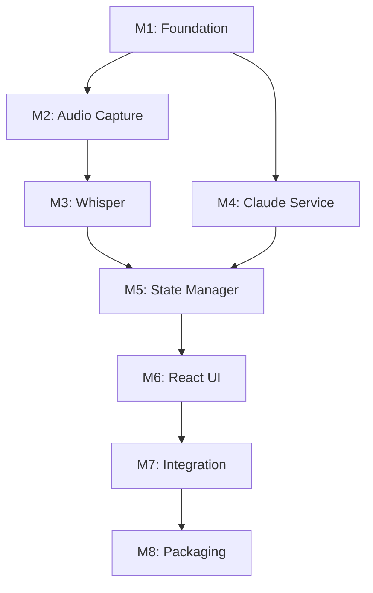

# Meeting Copilot - Implementation Plan

## Overview

This plan follows TDD principles: tests are written before implementation. Each milestone produces a working, testable increment.

---

## Milestone 1: Project Foundation

### Goal

Set up the development environment with Electron + React + TypeScript, basic build pipeline, and test infrastructure.

### Tasks

1. **Initialize Electron project**
   - Create package.json with Electron, React, TypeScript dependencies
   - Set up Vite for bundling
   - Configure electron-builder for packaging

2. **Set up project structure**

   ```
   src/
   ├── main/           # Electron main process
   ├── renderer/       # React frontend
   ├── shared/         # Shared types/utils
   └── preload/        # Preload scripts
   ```

3. **Configure testing**
   - Install Vitest for unit/integration tests
   - Install Playwright for E2E tests
   - Create test fixtures directory
   - Write first skeleton tests

4. **Set up linting and formatting**
   - ESLint with TypeScript rules
   - Prettier configuration
   - Husky pre-commit hooks

5. **Create basic window**
   - Main window with minimal React app
   - IPC communication scaffolding
   - Hot reload for development

### Deliverable

Empty Electron app that launches, shows "Meeting Copilot" title, and has green CI pipeline.

---

## Milestone 2: Audio Capture

### Goal

Capture microphone audio with proper macOS permissions and VAD.

### Tests First

- `AudioCaptureService` unit tests (initialization, capture, VAD)
- Permission handling tests

### Tasks

1. **Microphone permissions**
   - Add entitlements for audio input
   - Request permission on first use
   - Handle permission denied gracefully

2. **AudioCaptureService implementation**
   - Use Web Audio API in renderer
   - Stream PCM data to main process via IPC
   - Configure 16kHz sample rate, mono

3. **Voice Activity Detection**
   - Simple RMS energy-based VAD
   - Configurable silence threshold
   - Emit speech segments with start/end times

4. **Status indicator**
   - Show mic permission status
   - Show audio level meter
   - Recording/paused indicators

### Deliverable

App captures audio, shows level meter, emits speech segments to console.

---

## Milestone 3: Whisper Integration

### Goal

Transcribe audio segments using local whisper.cpp.

### Tests First

- `WhisperService` unit tests (initialization, transcription, language detection)
- Mock audio fixtures for testing

### Tasks

1. **Whisper.cpp native addon**
   - Integrate whisper.cpp via N-API
   - Bundle 'small' model with app
   - Load model on app start

2. **WhisperService implementation**
   - Accept Float32Array audio segments
   - Return TranscriptionChunk with text, language, confidence
   - Handle errors gracefully

3. **Integration with audio pipeline**
   - Connect VAD output to Whisper input
   - Process segments asynchronously
   - Show transcription in debug panel

4. **Language detection**
   - Auto-detect English/French
   - Tag each segment with detected language

### Deliverable

App transcribes speech to text in real-time, displayed in debug panel.

---

## Milestone 4: Claude Analysis Service

### Goal

Send transcription to Claude API and parse structured meeting insights.

### Tests First

- `ClaudeAnalysisService` unit tests (analysis, parsing, error handling)
- Mock API responses for testing

### Tasks

1. **API client setup**
   - Anthropic SDK integration
   - API key management (keychain storage)
   - Request/response logging

2. **System prompt engineering**
   - Implement meeting copilot system prompt
   - Define output format parsing
   - Handle partial/malformed responses

3. **ClaudeAnalysisService implementation**
   - Accept transcription buffer
   - Return structured MeetingAnalysis
   - Parse all 7 output sections

4. **Batching logic**
   - Accumulate chunks for 5-10 seconds
   - Trigger analysis on batch ready
   - Handle immediate triggers for Copilot questions

5. **Error handling**
   - Retry with exponential backoff
   - Queue requests during rate limiting
   - Graceful degradation on API failure

### Deliverable

App sends transcription to Claude, receives structured analysis, logged to console.

---

## Milestone 5: Meeting State Manager

### Goal

Central state management for meeting data with proper entity tracking.

### Tests First

- `MeetingStateManager` unit tests (state transitions, accumulation, deduplication)

### Tasks

1. **State structure**
   - Implement MeetingState interface
   - Initialize default state
   - State serialization for debugging

2. **State transitions**
   - idle -> recording -> paused -> idle
   - Proper cleanup on reset

3. **Entity management**
   - Add/update decisions
   - Add/update actions (with deduplication)
   - Track open questions
   - Detect and track loops
   - Identify contradictions
   - Surface assumptions and ambiguities

4. **Context window management**
   - Sliding window for transcription (10 min)
   - Summarize and compact old content
   - Preserve important entities

5. **IPC bridge**
   - Emit state changes to renderer
   - Handle commands from renderer

### Deliverable

State manager properly tracks all meeting entities, accessible from renderer.

---

## Milestone 6: React UI

### Goal

Build the user interface with all meeting insight panels.

### Tests First

- Component unit tests with React Testing Library
- E2E tests with Playwright

### Tasks

1. **Layout and theme**
   - Main window layout (header, panels, controls)
   - Design system setup (Tailwind)
   - Dark/light mode support

2. **StatusIndicator component**
   - Recording/paused/idle states
   - Pulsing animation for recording
   - Error states

3. **LiveSummary component**
   - Display RESUME_LIVE bullets
   - Auto-update on state change
   - Scroll behavior

4. **DecisionsList component**
   - List of extracted decisions
   - Owner and timestamp display
   - Visual styling

5. **ActionsList component**
   - List of actions
   - Owner, deadline, status
   - Highlight items needing clarification

6. **OpenQuestions component**
   - List of open questions
   - Highlight for emphasis

7. **TensionAlerts component**
   - Loop detection alerts
   - Contradiction display
   - Facilitator suggestions

8. **DirectResponse component**
   - Show Copilot responses
   - Triggered by direct questions
   - Dismissible

9. **Controls component**
   - Start/Pause/Resume/Reset buttons
   - Duration display
   - Settings access

### Deliverable

Full UI displaying all meeting insights in real-time.

---

## Milestone 7: Integration and Polish

### Goal

Connect all components end-to-end and polish the experience.

### Tests First

- Full E2E tests covering happy path
- Performance tests

### Tasks

1. **End-to-end pipeline**
   - Audio -> Whisper -> Claude -> State -> UI
   - Verify all connections work
   - Handle edge cases

2. **Performance optimization**
   - Profile memory usage
   - Optimize re-renders
   - Reduce API token usage

3. **Error handling polish**
   - User-friendly error messages
   - Recovery flows
   - Logging for debugging

4. **Accessibility**
   - Keyboard navigation
   - Screen reader support
   - High contrast mode

5. **Settings**
   - Microphone selection
   - API key configuration
   - Language preference

### Deliverable

Polished app ready for testing with real meetings.

---

## Milestone 8: Packaging and Distribution

### Goal

Package the app for macOS distribution.

### Tasks

1. **App packaging**
   - electron-builder configuration
   - Code signing setup
   - DMG creation

2. **Auto-update**
   - Update server setup
   - electron-updater integration
   - Update notifications

3. **Documentation**
   - User guide
   - Troubleshooting guide
   - Privacy policy

### Deliverable

Signed, distributable macOS app.

---

## Risks and Spikes

### Spike 1: Whisper.cpp Native Addon

**Risk**: Building whisper.cpp as a native Node.js addon may be complex.
**Mitigation**: Research existing bindings (whisper-node, etc.) before building custom.

### Spike 2: macOS Audio Permissions

**Risk**: macOS audio permissions can be tricky in Electron.
**Mitigation**: Test on clean macOS install early, document permission flow.

### Spike 3: Claude Output Parsing

**Risk**: Claude's structured output may be inconsistent.
**Mitigation**: Build robust parser with fallbacks, test with many variations.

### Spike 4: Real-time Performance

**Risk**: Combined Whisper + Claude latency may feel too slow.
**Mitigation**: Profile early, consider streaming Claude responses if needed.

---

## Dependencies



---

## Definition of Done

A milestone is complete when:

1. All unit tests pass
2. All integration tests pass
3. E2E tests cover the milestone's features
4. Performance targets are met
5. Code reviewed and merged
6. Documentation updated
